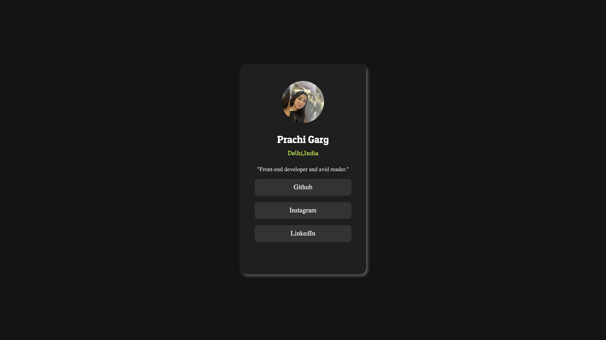

# Social-links-profile 🌐
A responsive landing page of Social links profile .
A **responsive** and **accessible** landing page to showcase your social media links in one place.

## 🚀 Features
- 📱 **Fully Responsive** – Works on all devices (mobile, tablet, desktop).
- 🎨 **Modern UI/UX** – Clean and minimalistic design.
- 🔗 **Clickable Social Links** – Easy access to your social media profiles.
- 💻 **Easy Customization** – Modify colors, links, and layout as needed.

## 📷 Preview


## 🛠️ Technologies Used
- **HTML5**  
- **CSS3**
- 
## 🎯 How to Use
1. Clone the repository:  
   ```bash
   git clone https://github.com/prachi757/Social-links-profile.git
